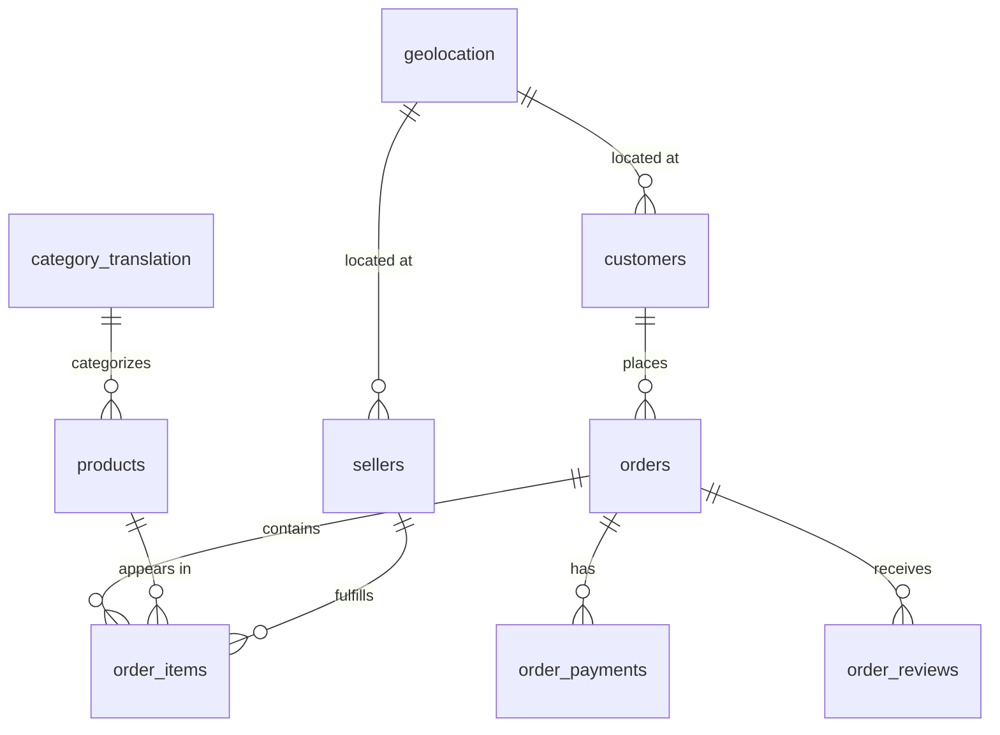

```mermaid
erDiagram
    customers ||--o{ orders : "places"
    orders ||--o{ order_items : "contains"
    products ||--o{ order_items : "appears in"
    sellers ||--o{ order_items : "fulfills"
    orders ||--o{ order_payments : "has"
    orders ||--o{ order_reviews : "receives"
    category_translation ||--o{ products : "categorizes"
    geolocation ||--o{ customers : "located at"
    geolocation ||--o{ sellers : "located at"
```
